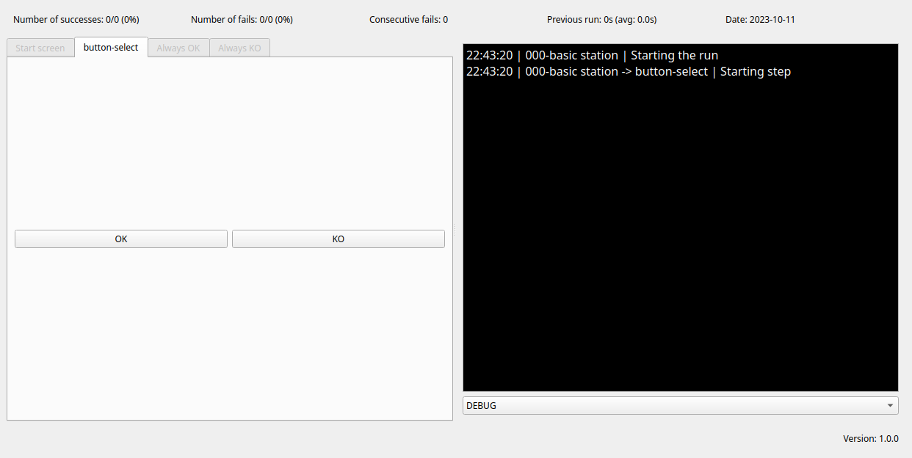

Sopic
======

Test stations GUI library for your hardware on a production line.

Define a station that will run a number of steps, in sequential order.
Visualize the steps with the GUI


# Screenshots




# Installation

`pip install sopic`


# How to use

Initialise `MainWindow` with a station object, child of the `Station` class.

In your station class you can define the steps in a DAG and settings for the
runs.


# Keybinds

- `Ctrl-Q`: exit the station
- `Ctrl-P`: display the settings dialog, when available
- `Ctrl-B`: display the logs

# Definitions

A step is the smallest component, a class invoked at the start of the station.
The `start` method from this object will be called to start the step. The step
has then access to data from previous steps, if they provided it, settings and
current run info.
After being called the step can either returns `self.OK()` or `self.KO()` to
notify the station if the step has passed or not. These two methods take a
parameters to select the next step.

A station is a group of steps. The steps are defined in a Direct Acyclic Graph.

A run is the succession of the steps. A run can either Pass or Fail. A station
will perform multiple runs.


# Features

- GUI
- Share data between steps
- Settings for step configuration
- Logs
- Easy to customize with wrappers

# Define a station

```python
from sopic import Station

class MyStation(Station):
    # Used as window title, log file, settings file
    STATION_NAME = 'my-station'
    # Same use as STATION_NAME
    STATION_ID = 0
    # Optional, displayed in the bottom right corner of the main window
    STATION_VERSION = "1.0.0"

    # Will generate a png output of the dag
    DEBUG = True

    # Select the first step, via its key
    start_step_key = "start"

    # DAG of the steps
    dag = {
        # first step
        # `StartButton` is the step class
        # `["select"] is the child, no matter if the StartButton fails, the
        # child will be the one with the `"select"` key
        "start": (StartButton, ["select"]),
        # This step define another step class, `Select`
        # This step can select one of two childs
        # - "foo", if the step returns the key "ok"
        # - "bar", if the step returns the key "ko"
        "select": (Select, {"ok": "foo", "ko": "bar"}),
        # The next two steps don't have any child, returning for those step
        # will end the run
        "foo": (AlwaysOK, []),
        "bar": (AlwaysKO, []),
    }

    # Default settings of the station. Can be updated with the SettingsDialog.
    default_settings = {
        "random-settings": {"value": 42, "label": "A random settings"},
    }
```

# Define a step

```python
from sopic import Step

class MyStep(Step):
    # Name of the step, used for display and logs
    STEP_NAME = 'my-step'
    # Number of retries allowed on fail
    MAX_RETRIES = 1

    # Called when the step is started
    # `context` contains value stored by previous steps
    # `settings` contains the station settings
    # `run_info` contains current run information
    def start(self, context, settings, run_info):
        super().start()

        # Add your tests here

        return self.OK()
```


# Examples

[Check the examples directory](./examples)

To run the examples:
```bash
git clone https://github.com/Taldrain/sopic
cd sopic
poetry install
poetry run examples/00_basic.py
```


# See also

[exclave](https://github.com/exclave/exclave)

[Exclave: Hardware Testing in Mass Production, Made Easier](https://www.bunniestudios.com/blog/?p=5450)

[awesome-hardware-test](https://github.com/sschaetz/awesome-hardware-test)
